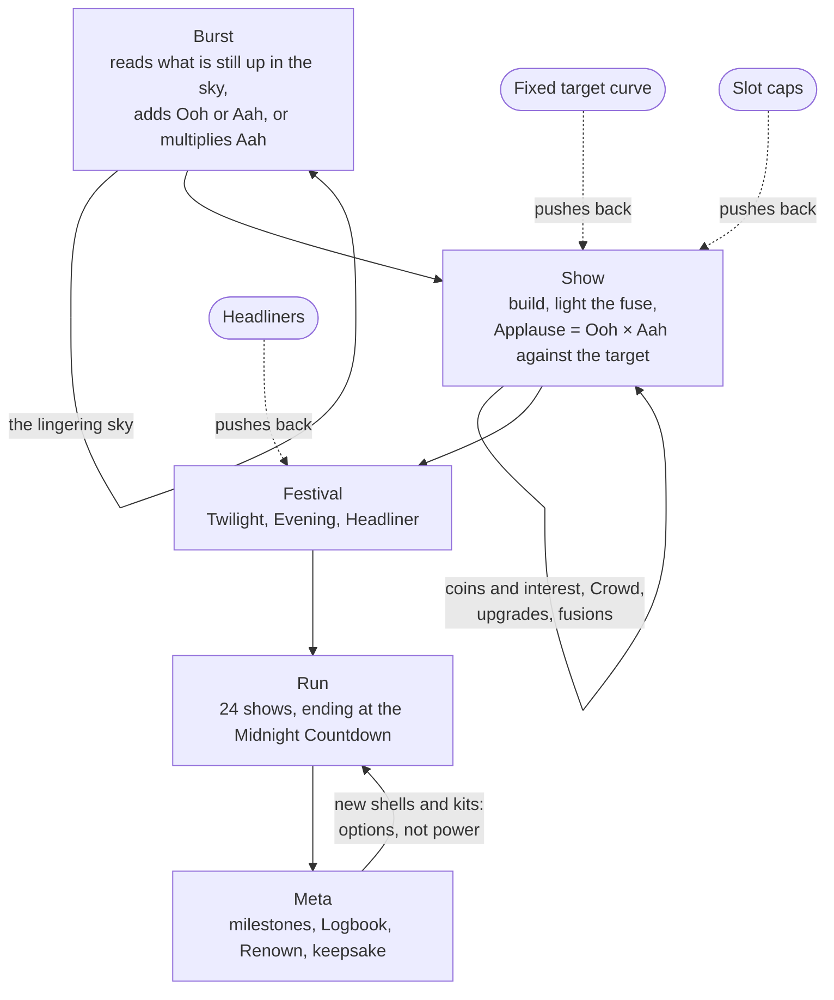

# Ooh × Aah

Load fireworks into a rack of mortar tubes and light one fuse. Every burst scores off whatever earlier bursts left hanging in the sky, and the crowd's Applause is literally Ooh × Aah.

Ooh × Aah is a turn-based engine-builder roguelite for the browser. A river town hires you to fire its festival year: 8 festivals of 3 shows each, 24 shows in all, ending with New Year's Eve's Midnight Countdown. It is portrait-first, works at 360 px wide, supports full keyboard play, and ships as one self-contained HTML file. All art and audio are procedural; the file loads no image, sound or script files.

- Design spec: [DESIGN.md](DESIGN.md)
- Module contract: [src/CONTRACT.md](src/CONTRACT.md)
- Research brief: [../what-makes-games-fun.md](../what-makes-games-fun.md)

---

## Play it

- **Hosted:** [claude.ai/artifact/KyGfV5nDSmHM4h7DuA69D8](https://claude.ai/artifact/KyGfV5nDSmHM4h7DuA69D8). The page is private to its owner until it is shared.
- **Locally:** open [`index.html`](index.html) in any current desktop or mobile browser. It is a single file: there is nothing to install, no server and no build step. Google Fonts is the only network request, and the game falls back to system fonts offline.

The page opens straight into the first show's build, with no menu in front of it. Sound starts on your first tap or key press. Progress is saved in `localStorage` under the key `oohxaah.v1`, and the game also runs with storage blocked.

**Controls.** Tap a shop card, then tap a tube to buy the shell into that tube, or drag the card onto the tube. Drop a card on a tube that holds its twin to upgrade the twin. Press **Light the fuse** when the rack is ready. Every action has a key; press `?` in the game for the full map.

**URL flags** (useful for demos and testing):

| Flag | Effect |
|---|---|
| `?seed=abc` | Fixes the run seed |
| `?kit=salvo` | Starting kit (`apprentice`, `salvo`, `chemist`, `market`, `showman`) |
| `?renown=3` | Renown (difficulty) level |
| `?unlock=all` | Unlocks all content |
| `?fresh=1` | Ignores saved progress |
| `?debug=1` | Overlay with frame time, SIM time, particle counts and the state hash |
| `?test=1` | Test mode: no animation loop, instant animations, deterministic effects |
| `?sim=200&bot=human` | Runs 200 bot games in a Web Worker and shows a JSON summary on the page and in the console |

---

## The rules card

The in-game help card shows exactly these three lines:

1. The fuse fires your tubes left to right. Each burst stays up for the next few bursts (its Hang), and later shells score by what is still up.
2. Shells add Ooh, add Aah, or multiply Aah; your Crowd adds its size to Ooh. Applause = Ooh × Aah must beat the target (one rain check per run).
3. Between shows, spend coins on shells, tubes and rigs. Drop a shell on its twin to upgrade it; a shell fired right after its partner fuses with it.

---

## How the loop builds on itself

The game is five nested loops. Each one's output is the next one's input.

| Loop | Length | What happens | What it feeds |
|---|---|---|---|
| **Burst** | A fraction of a second | One shell fires. It reads the bursts still up, adds Ooh, adds Aah or multiplies Aah, then ages every burst up by 1 and hangs for its own Hang. | The sky the next burst reads |
| **Show** | 25–45 s | Build (buy, upgrade, arrange, add a rig, take a Sponsor), light the fuse, watch the 2–5 s chain, get paid. | Coins, interest, Crowd and the rack for the next show |
| **Festival** | About 2 min | Twilight (target ×1), Evening (×1.3), then a Headliner (×1.8) with a rule twist. | A shop after every Headliner as a breather; Uncommon shells from Festival 3, Rares from Festival 4 |
| **Run** | 3–5 min for a first run; 12–18 min for a win | 8 festivals, 24 shows, ending with the Midnight Countdown. One rain check forgives one miss. | Milestone progress, Logbook entries, a keepsake shell, Renown |
| **Meta** | Across runs | Milestones unlock shells and kits; the Logbook records every shell, fusion and Headliner; Renown is an opt-in difficulty ladder. | New options for the next run, never permanent power |

### What compounds

- **The lingering sky.** A burst stays up for its Hang, counted in later bursts, and every burst ages the sky by 1. Later shells score by what is still up: a Chrysanthemum adds 20 Ooh per burst up, a Crossette adds 4 Aah per burst up, and a Salute clears the sky for 3 Aah per burst it clears. Order is free depth. In the first run's second show, a Red Palm placed in the empty last tube scores 189; placed right after the Red Peony, it scores 378. Every tube shows a "sees N" chip and a fire-order numeral, so the player can see this before lighting.
- **Ooh × Aah.** Ooh is the additive bucket and Aah is the multiplier. Aah starts at 1. Some shells add to it, and the × shells multiply it. A × shell multiplies only the Aah that has arrived before it, so order matters inside the multiplier too. Of the 34 shells, 8 multiply Aah, all of them rare and 6 of them Blue. Only 6 (Peony, Strobe, Willow, Roman Candle, Girandola and Smiley) have card text that does not depend on context; the other 28 read the sky, a colour, their position, the fire count or the Crowd, or change what later shells read.
- **The Crowd.** The Crowd never goes home. It grows by 1 for every show you pass, by 2 more at each Headliner, and by 2 × the festival number on an Encore (Applause of at least twice the target). Some shells add Crowd directly. At the end of every show the Crowd adds its size to Ooh. Overkill therefore pays forward into every later show instead of being banked. In the reference simulation the Crowd supplies 18% of the Ooh at the Midnight Countdown for the human proxy (median). <!-- VERIFY -->
- **Coins and interest.** A passed show pays $4 ($6 at a Headliner), plus $1 of interest for every $5 you hold, up to +$5. Every shop is a choice between spending now and holding for interest.
- **Upgrades, fusions and rigs.** Dropping a shell on its twin makes it ★2, which doubles all its numbers (★3 quadruples them; a ×1.5 becomes ×2, then ×3). Twelve directional fusions fire when shell A fires immediately before shell B: Palm then Palm makes a Palm Grove (+3 Aah); Salute then Comet makes a Thunderclap Comet (×1.3 Aah). Rigs belong to the tube, not the shell: a Tall Tube adds Hang, a Brass Tube adds Aah, a Spotlight doubles Ooh, and a Mortar fires its tube twice.

### What pushes back

- **The fixed target curve.** Targets never read the player's power. They run from 100 at show 1 to 180,000 at the Midnight Countdown. Festival bases are 100, 330, 1,000, 2,600, 5,500, 9,600, 16,000 and 26,500, with show multipliers ×1, ×1.3 and ×1.8. The steepest climb (×3.3, ×3.0, ×2.6 per festival) comes in Festivals 2–4, while the engine comes online. From Festival 5 the curve eases to just below measured power growth, so strong builds pull ahead before the final exam. The HUD always shows the next two targets.
- **Headliners.** Every third show has a rule twist drawn from a pool of 12, posted a festival ahead and drawn on the rack as a telegraph. Each counters a strategy: Fog limits every shell to the 2 newest bursts (against long canopies), The Critic zeroes the Ooh of a burst that repeats the previous colour (against one-colour racks), Wind Shift reverses the fuse (against rigs and fusions), and Rival Crew halves your ♛ Crowd Favourite, the shell your score leans on most. The Midnight Countdown is the final exam: the fuse counts down from the last tube to the first, then fires first to last, so every shell fires twice, and the rain check does not apply.
- **Slot caps.** You start with 4 tubes and can own at most 6 ($6 for the 5th, $10 for the 6th). The Crate holds 2 spare shells, which don't fire. Each tube takes one rig, and a rack takes one Mortar. From mid-run every good buy replaces something. Rerolls cost $1 more each time within a shop, interest is capped at +$5, and selling returns 75% of what you paid.
- **One rain check.** The first miss is forgiven and turns the rack rim red. A second miss, or any miss at the Midnight Countdown, ends the run.

The player can raise their own stakes. From Festival 3, a **Sponsor** offers a reward for a ×1.5 target on that show. The **Crowd mood** (Restless, Hopeful or Eager) reads the current rack against tonight's target. It never shows a number, so it can tell the player whether a Sponsor is safe without revealing the score.

---

## How it was made

The game was designed before it was built, and every balance number in the spec was produced by simulation, not by estimate.

Every role below was filled by an AI agent (Claude), run in parallel through Claude Code: the researchers, the pitch writers and judges, the red team, the engineers and the reviewers. A lead session wrote the module contract, made the design calls, integrated the modules and ran the verification.

1. **Research brief.** [what-makes-games-fun.md](../what-makes-games-fun.md) combines seven research angles: theory of fun, incremental loops, roguelite synergy, systems and emergence, game feel and onboarding, feedback loops and balance, and single-file browser engineering. It turns them into eight design principles, loop anatomy, checkable feel and onboarding rules, a ranked list of pitfalls, implementation rules, and a **14-criterion fun rubric**. Four criteria count double: depth of compounding, meaningful decisions per minute, pressure scaling, and resistance to degenerate strategies. The ship gate is a weighted mean of at least 4.0 with no criterion below 3. The brief states its own limits: most primary sources could not be fetched, so its numbers are treated as starting values to tune by simulation.
2. **Five competing pitches.** Five concepts (Ooh × Aah, Everpot, Bottleneck, Quickmatch and Foxfire) were each scored by a panel of three judges against the rubric, using the rubric's concept-stage method: the rules, a data-table sketch and a paper walkthrough of round 1, round 12 and the final boss. Ooh × Aah had the top weighted mean (4.50), and two of the three judges ranked it first. The runner-up, Everpot (4.45), had structural flaws: in two judges' probes one resource carried about 99% of the final score, and with no verb for moving pieces, late rounds thinned out to rerolling. Ooh × Aah then took the best idea from each of the other pitches: the Crowd and the Crowd Favourite from Everpot, Sponsors and the near-miss readout from Bottleneck, fire-order ordinals and soot marks from Quickmatch, and Headliners posted a festival ahead plus the pity rule from Foxfire. [DESIGN.md §0](DESIGN.md#0-decision-record) records every judge's objection and the fix for it.
3. **Build spec tuned by a headless simulator.** [DESIGN.md](DESIGN.md) is written so an engineer can implement it without asking questions. A headless reference simulator of its exact rules ran a ladder of bots over 1,000 seeds, plus analysis passes for draw luck, pick/win rates per shell, decision points, score attribution, the score ceiling and the first run. The spec also commits in advance to which lever moves if a gate fails (for example, "human proxy wins > 60%: raise the Festival 5–8 bases by 5%").
4. **Red team.** An independent team re-implemented the spec from its text alone and attacked it. Their most serious finding: v1.0 had been balanced against a bot with perfect information, which no player has. Other findings covered the Countdown's fire order, hard-counter Headliners, first-run onboarding, mobile height and unreadable Sponsors.
5. **Revision (v1.1).** Every red-team item was either fixed, with its measured effect recorded ([DESIGN.md §0.1](DESIGN.md#01-v11-revision-red-team-changes-and-their-measured-effect)), or rejected or modified with a reason ([Appendix A](DESIGN.md#appendix-a-rejected-or-modified-red-team-items)). The ship gate moved to a human-like bot. The Crowd mood, the Match button and the Fair Weather assist were added, the Countdown's direction was redesigned, and the target curve was retuned. A new spec-literal simulator regenerated every number. The spec now carries 30 golden score tests (15 of them new in v1.1), a Match property test and 3 seed-level traces, which the shipped simulation must match exactly.
6. **Parallel build.** Nine owners built the game at the same time, one per row of the ownership table in [src/CONTRACT.md](src/CONTRACT.md): the simulation, audio, effects, core, four UI modules, and tooling. The contract fixes file names, the one global each module may define, the cross-module APIs, the events and the DOM ids, so each module could be built and tested against the contract before the others existed.
7. **Review rounds.** The assembled build was reviewed in rounds, each lens backed by its own tool (see [Tools](#tools)): rules fidelity against the spec's tables, golden tests and seed traces (`spec-audit.mjs`); balance against the §12.2 gates (`balance/analyze.mjs`); accessibility and layout in a real browser (`a11y.mjs`); performance on a throttled phone profile (`perf.mjs`); robustness under random input (`fuzz.mjs`); and first-run pacing through the real UI (`humanplay.mjs`). Findings went back to the module owners, and a finishing pass per module closed them. <!-- VERIFY: number of review rounds, and whether the fun-rubric re-score of the built game is recorded anywhere -->

### Balance results

These are the reference results from DESIGN.md §12.2: v1.1 rules, 1,000 seeds (`1..1000`) unless noted. The ship gate sits on the `human` bot, a player who has learned the rules and uses the on-screen chips and the Crowd mood. The `oracle` bot has perfect information and searches every arrangement; it only checks that skilled play has headroom.

<!-- VERIFY: re-run `node tools/test-sim.mjs --seeds=1000` and `node tools/balance/analyze.mjs --seeds=1000` against the shipped src/sim.js and confirm every number in this section, or replace it with the measured value. -->

| Bot | What it models | Gate | Win rate |
|---|---|---|---|
| `novice` | Noisy valuation of every option, one rearranging pass, ignores the mood | 8–25% | **18.8%** |
| `human` (ship gate) | Noise per offer, exact placement from the chips, rearranges until the mood reads Eager | 40–60% | **50.7%** |
| `oracle` (headroom) | Perfect information, exhaustive search over up to 720 arrangements | 75–92% | **81.6%** |

On v1.0 rules the same three bots won 9.5%, 40.0% and 70.0%.

The shipped simulation (`src/sim.js`), checked with `node tools/balance/analyze.mjs --seeds=200 --only=winrates`, gives 14.5% (novice), 51.5% (human) and 79.5% (oracle): all three inside their gates and within 200-seed sampling error of the reference. <!-- VERIFY: replace with the 1,000-seed figures after the final build -->

**Lazy and synergy-blind strategies win nothing:**

| Bot | Strategy | Win rate | How it loses |
|---|---|---|---|
| `random` | Random purchases and arrangement (400 seeds) | 0% | 93% die in Festivals 1–2 |
| `do-nothing` | Lights the fuse every show and never buys (200 seeds) | 0% | All die in Festival 2 |
| `greedy` | Buys the best-looking shell, ignores synergy, never rearranges | 0% | 93% of deaths in Festivals 2–4; median 8 shows |
| `greedy-mood` | Greedy, but rearranges when the crowd is Restless (the first-run proxy) | 0% | Median run 10 shows, about 3.4 minutes |

**Other gates the reference simulation meets:**

- **The finish is where runs are decided.** 91% of the human proxy's losses come in Festivals 6–8. The oracle's outcome first becomes 90% predictable at show 19 of 24, and the human's only at the Countdown.
- **The final exam is passable.** The human proxy passes 76% of its Midnight Countdowns (oracle 89%, novice 64%).
- **No Headliner is a run-killer.** The human proxy misses every Headliner at most 30% of the time (the hardest, Rival Crew, 28%). Drawing any given Headliner moves its win rate by at most 8 points.
- **The risk offer is a real choice.** A bolder human proxy that takes Sponsors at Hopeful wins 49.4%, against 50.7% for the cautious one. Removing Sponsors costs 8 points (human) and 9 (oracle) over 400 seeds.
- **Meta adds options, not power.** With only the starting pool, the human proxy wins 56.5% (200 seeds), against 50.7% with everything unlocked, so unlocks widen choice without making runs easier. Every starting kit stays inside the ±10-point gate: the human proxy wins 47.0% to 59.0% across the five kits, against 50.7% for the default (200 seeds). <!-- VERIFY: the spec asks for kit and Renown rows to be re-measured after the Saturn trim (§12.3) -->
- **Difficulty ladder.** Win rates fall across the eight Renown levels, within the spec's ±5-point tolerance, to 12% (oracle) and 5% (human) at Renown 8 (200 seeds).
- **The assist works.** Fair Weather (targets ×0.75, one Countdown relight) takes the novice from 16.8% to 49.5% on the same 400 seeds.
- **No degenerate loops.** The human proxy rerolls about 2.5 times per run, holds a median $3 at payout (no stalling for interest), and every shell's pick/win rate stays within 22 points of the base rate.

The spec's last gate is a cold stopwatch test with three people (DESIGN.md §12.4): the first run should last 3–5 minutes, and at least 2 of 3 testers should predict Applause within 2× by show 6. This human test has not been run yet. Until it is, `tools/humanplay.mjs` is the stand-in: it plays the real interface at the spec's modelled human pacing and measures the same onboarding gates.

---

## Architecture

The game is one HTML file, [`index.html`](index.html), assembled by `tools/build.mjs` from the sources in [`src/`](src/). The code is not minified. The spec's original size target (150 KB) was lifted during the build so that no feature tier would be cut: the build now warns above 800 KB and fails above 1,200 KB ([src/CONTRACT.md](src/CONTRACT.md), "Size"). The shipped file is about 705 KB, or about 212 KB gzipped. <!-- VERIFY: re-read both numbers from the `node tools/build.mjs` size table after the final build -->

The file has no `<!doctype>`, `<html>`, `<head>` or `<body>` tags, because the hosting page wraps it. Its first lines are the charset and viewport metas, so it is still correct when opened raw from the repo. The build concatenates, in this order:

1. `src/head.html`: the metas and the title.
2. One `<style>`: `base.css`, `play.css`, `panels.css`, `end.css`, `menus.css`.
3. `src/body.html`: the static DOM skeleton. Each module renders into its own containers.
4. One `<script>`: `sim.js`, `audio.js`, `fx.js`, `core.js`, `ui-play.js`, `ui-panels.js`, `ui-end.js`, `ui-menus.js`, then `GAME.boot();`.

### Modules

Each JS module defines exactly one global in a shared scope and edits only its own files.

| File | Global | Responsibility |
|---|---|---|
| `sim.js` | `OohSim`, `OOH` | The pure rules engine: state, actions, the show resolver, shop and economy, content tables, helpers, and the bots |
| `audio.js` | `AUDIO` | Procedural WebAudio: crowd "oo" and "aa" vowels, burst noise, the × bell, music. Never throws, even without WebAudio. |
| `fx.js` | `FX` | Canvas 2D sky: skyline, burst patterns, pooled particles, pacing of the resolution chain, token pictograms |
| `core.js` | `GAME` | SIM state, fixed-timestep loop, show flow, undo, persistence, meta, overlays, keyboard routing, test hooks |
| `ui-play.js`, `play.css` | `UI_PLAY` | HUD, Sponsor strip, sky labels, rack, tools, shop, workshop, fire button, inspect sheet; drag and selection; the build-phase chips |
| `ui-panels.js`, `panels.css` | `UI_PANELS` | Desktop festival board and show log (the show log opens as a sheet on mobile) |
| `ui-end.js`, `end.css` | `UI_END` | End screen: poster, Applause curve, near-miss, lesson, unlock bars, Pareto chart, keepsake, Run it back |
| `ui-menus.js`, `menus.css` | `UI_MENUS` | Pause, settings, Logbook, help, toasts, tap-to-continue |
| `base.css`, `body.html`, `head.html` | none | Design tokens, reset, type scale, layout frame, shared primitives; DOM skeleton; page metas |

### A pure, deterministic simulation

- `sim.js` is a self-contained factory, `OohSim()`, with no outside references. The same source runs in the page, in Node (`module.exports`), and in a Web Worker the page builds from `OohSim.toString()` for in-page bot runs.
- State is plain JSON. `step(state, action)` applies one action and returns events. Pointer input, keyboard input and bots all emit the same action objects.
- The only randomness is a seeded sfc32 generator, stored in the state and advanced only inside the SIM. Cosmetic effects use a separate generator, bots use their own xorshift32, and the SIM never calls `Math.random` or `Date.now`. The same seed and the same action log always give the same `hashState`.
- Resolution is instant and emits an ordered event trace. Effects, audio and screen-reader text all subscribe to those events, so the same run can play with full effects, with reduced motion, or headless.
- The end screen's "What made your applause" chart splits each show's Applause among the tubes and the Crowd using exact Shapley values (at most 128 resolves per show). It is the game's only nod to the [Lean Six Sigma work](../../lean-six-sigma-training-program/README.md) elsewhere in this portfolio, and the game uses none of that vocabulary.

### Test hooks

With the page loaded, `window.__game` exposes `reset(seed, opts)`, `act(action)`, `step(n)`, `state()`, `legalActions()`, `events()`, `hash()`, `setPaused(bool)`, `config`, `resolve(tubes, ctx)`, `preview()`, `mood()`, `shapley(showIndex)`, `skipAnimations(bool)`, `runBots({bot, n, opts})`, `meta()`, `setMeta(obj)`, `ui()` (the presentation state, also mirrored to `#app[data-ui]`) and `game` (the `GAME` object). The DOM ids the browser harness relies on are listed in [src/CONTRACT.md](src/CONTRACT.md#dom-ids-the-playwright-harness-relies-on-these).

### Tools

Run these from `games/ooh-and-aah/` with Node.js 18 or later. `build.mjs`, `test-sim.mjs` and `balance/analyze.mjs` need nothing else; the other tools drive Chromium through Playwright (they load it from the global `node_modules` and never run `playwright install`). The browser tools test the built `index.html`, most of them inside a document wrapper like the one the hosting page adds, and they block or ignore Google Fonts requests so they run offline. Every tool exits non-zero when a check fails, except `balance/analyze.mjs`, which reports gate failures and exits non-zero only with `--strict`. All tools except `test-sim.mjs` and `audio-check.mjs` print their options with `--help`; those two document theirs in the header comment.

| Command | What it does | Useful flags |
|---|---|---|
| `node tools/build.mjs` | Assembles `index.html` from `src/` in contract order, then checks the page contract: one global per module, `node --check` on every script, no external URLs except the fonts, no `Math.random` or `Date.now` in the SIM, and the size limits. Prints a size table per file. | `--out=FILE`, `--allow-missing` (stub files that do not exist yet), `--force` (write even on FAIL), `--quiet` |
| `node tools/test-sim.mjs` | The SIM suite: the 30 golden score tests and the Match property test, the 3 seed-level traces, unit checks on rules, kits and prices, the §11.7 invariants and timings, then the bot suite (200 seeds by default). Fails when a bot's win rate drifts more than 4 points from the §12.2 reference at 1,000 seeds (scaled by √(1000/N) at N seeds). | `--seeds=1000`, `--bots=human,novice,oracle`, `--no-bots`, `--workers=N`, `--json=FILE` |
| `node tools/balance/analyze.mjs` | Every §12.2 balance metric, printed next to its gate and its v1.1 reference value: win rates, where runs die, Countdown pass rates, Sponsors, Headliner miss rates and draw luck, pick/win outliers, decision regret and decision point, kits, Renown, Fair Weather, archetypes, milestones, mood buckets and Shapley sums. Writes a text and a JSON report to `tools/balance/out/`. | `--seeds=1000`, `--list`, `--only=winrates,headliners`, `--bots=`, `--strict` (exit 1 on any gate FAIL) |
| `node tools/audit/spec-audit.mjs` | Audits the game against DESIGN.md itself: parses the spec's tables and compares the game's data field by field, replays the golden tests and seed traces, runs behavioural SIM checks and a legal-action fuzz, checks the built file's page contract, then drives the page for hooks, URL flags, layout, persistence and the end screen. | `--no-browser` (Node-only checks), `--only=golden,trace,…`, `--bots 200` (adds the bot gates), `--verbose` |
| `node tools/audit/a11y.mjs` | Accessibility and layout audit at 360 × 740, 360 × 640, 375 × 548 and 1440 × 900: contrast, accessible names (including the tube label pattern), 44 px targets, 16 px text, visible focus and Tab order, keyboard reach and focus traps in every overlay, live-region announcements, reduced motion, high contrast, greyscale distinguishability, overflow and hover-only content. | `--viewports 360x740,1440x900`, `--checks abk` (a subset of checks a–l), `--no-fonts`, `--query "fresh=1&seed=abc"` (this tool takes space-separated values) |
| `node tools/playtest.mjs` | Browser playtest harness: page contract, layout, tap targets, focus, the play loop and the test hooks, with screenshots and a JSON report. | `--flow=smoke\|ui\|keys\|bots\|full`, `--viewports=`, `--seed=`, `--shows=N` |
| `node tools/humanplay.mjs --fast` | A human-proxy player that uses only the real UI (taps, drags, the chips and the mood pill; the test hooks are read only as telemetry). It measures the §12.4 gates it can: first-run length, time to the first 1-of-3 choice, decisions per minute by third of the run, and Applause/target per show, and saves a filmstrip to `tools/shots/humanplay/`. Without `--fast` it plays at the spec's modelled human pace. | `--runs N`, `--seed abc`, `--fresh`, `--viewport 360x740`, `--strict`, `--json` |
| `node tools/fuzz.mjs --minutes 3 --seed 1` | A seeded chaos monkey: random taps, drags, cancelled touches, long-presses, keys, resizes, blur and tab hiding, reloads, plus an autopilot that reaches late shows. After every burst it checks state invariants, errors, `NaN` or `undefined` in visible text, double-lit fuses and that the game never gets stuck. A failure is saved with its action log to `tools/shots/fuzz/`. | `--viewports 360x740,1440x900`, `--replay FILE`, `--query debug=1` |
| `node tools/perf.mjs` | Performance against the §11.1 and §11.7 budgets on a CPU-throttled 360 × 740 phone profile and a 1440 × 900 desktop profile: boot time, frame intervals and dropped frames on a normal show and on the Midnight Countdown, `FX.render` time, particle counts, `step` and `resolveShow` time, and heap growth over 10 shows. | `--quick`, `--profiles=mobile`, `--throttle=4`, `--json` |
| `node tools/gallery.mjs` | A screenshot contact sheet of every screen at the four viewports, plus frame-by-frame filmstrips of show chains, in `tools/shots/gallery/index.html`. | `--list`, `--only=IDS`, `--no-strips`, `--viewports=` |
| `node tools/audio-check.mjs` | Audio self-test: every API call is a silent no-op without WebAudio; on a live page, lazy unlock on a real click, every event and UI sound, every music phase, the 8-voice limiter and suspend on hide; offline renders of every sound are audible and never clip. | `--levels` (print the measured peak levels as JSON) |

A reasonable pre-release pass, in order: `build.mjs`, `test-sim.mjs --seeds=1000`, `audit/spec-audit.mjs`, `playtest.mjs`, `audit/a11y.mjs`, `audio-check.mjs`, `fuzz.mjs`, `perf.mjs`, then `humanplay.mjs --fast` and `balance/analyze.mjs --seeds=1000` for the numbers in [Balance results](#balance-results).

`tools/dev/` holds the stub harnesses each module owner used to build and test a module before the others existed. <!-- VERIFY: link tools/README.md here if the tooling owner adds it (build.mjs and playtest.mjs already refer to it) -->

---

## Accessibility

- **Screen size.** Portrait-first. The layout targets 360 × 740, 360 × 640, 375 × 548 and 1440 × 900 (desktop adds a festival board and a show log on either side). Below 700 px of height it switches to a compact layout; below 520 px the column scrolls and **Light the fuse** stays pinned, so it is never clipped.
- **Touch targets and text.** Every tap target is at least 44 × 44 px, and all text, including the fire-order numerals, is at least 16 px. The UI face is Atkinson Hyperlegible. Text contrast is at least 4.5:1.
- **Not colour alone.** Each firework colour has its own token shape (circle, triangle, square, diamond, cross, star), a pictogram of its burst and a two-letter monogram, so the game is playable in greyscale. The palette follows Okabe and Ito's colour-universal design. The Crowd mood is always a word plus a crowd pose.
- **High contrast.** A setting adds white outlines to tokens and removes glows.
- **Motion.** Reduced motion follows the OS setting, or can be forced on or off. It removes screen shake, zoom and flashes, and replaces bursts with soft glows. With any setting, the game never flashes more than 3 times per second.
- **Keyboard.** Every action has a key, and pointer and keyboard produce the same actions. Focus is always visible. When a run ends, focus lands on **Run it back**.
- **Screen readers.** Controls are real `<button>` elements with full labels, for example "Tube 3: Palm, Red circle, star 1, Hang 2, rig Brass, fires 3rd of 6, sees 2". Two live regions announce each build, purchase and result, and the "last chance" state.
- **No time pressure.** The game is turn-based. Nothing needs hovering or holding, confirmations stay armed until your next input, pause is always available, the show can play at 50%, 75% or 100% speed, and "Instant results" replaces the animation with a breakdown list.
- **Sound.** Sound is never the only cue: the mood has its word and the heartbeat has the red rim. Audio starts only after your first input. Haptics sit behind a setting.
- **Assist.** Fair Weather lowers every target by 25% and allows one relight of the Midnight Countdown. It is labelled on the HUD, the end screen and records, and it blocks Renown progress but not milestones.
- **No dark patterns.** There are no streaks, timers, energy systems, notifications, accounts, ads, purchases or analytics. The Daily Show, unlocked by a first win, is an invitation with no streak attached.

---

## Credits and sources

- **Design research:** [what-makes-games-fun.md](../what-makes-games-fun.md). Section 7 of the brief lists the books, talks, papers and postmortems it draws on, from Koster's *A Theory of Fun*, the MDA framework and self-determination theory to the Balatro, Slay the Spire, Hades, Into the Breach and Threes design writing.
- **Specification and balance data:** [DESIGN.md](DESIGN.md).
- **Random numbers:** sfc32 and the cyrb128 string hash, as collected in bryc's JavaScript PRNG notes.
- **Game loop:** fixed timestep after Glenn Fiedler's "Fix Your Timestep!".
- **Colour:** the Okabe and Ito colour-universal-design palette.
- **Fonts:** Fraunces (Undercase Type) for display and Atkinson Hyperlegible (Braille Institute) for the interface, both loaded from Google Fonts.
- **Art and audio:** procedural, generated in the browser at run time. The game uses no image or sound files.
